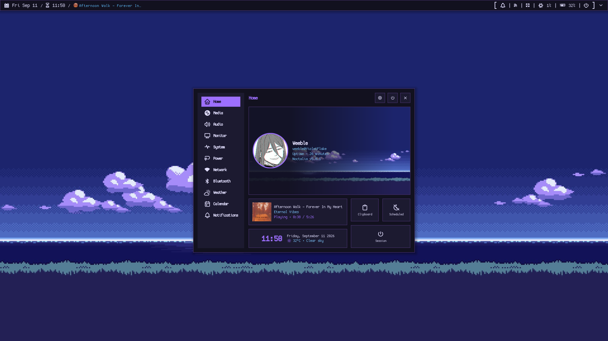
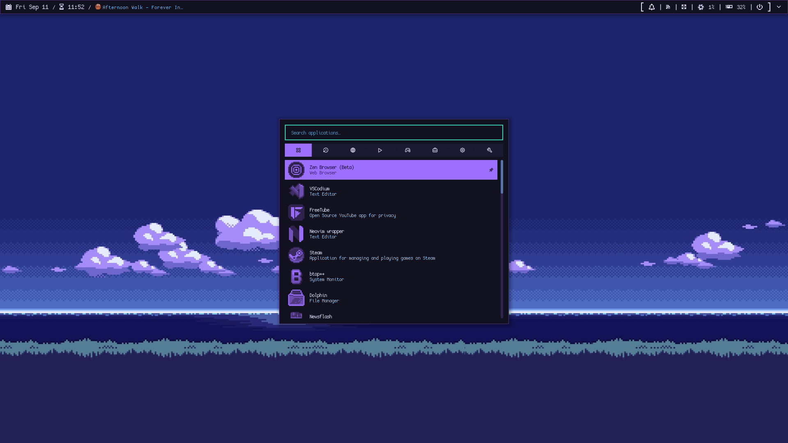
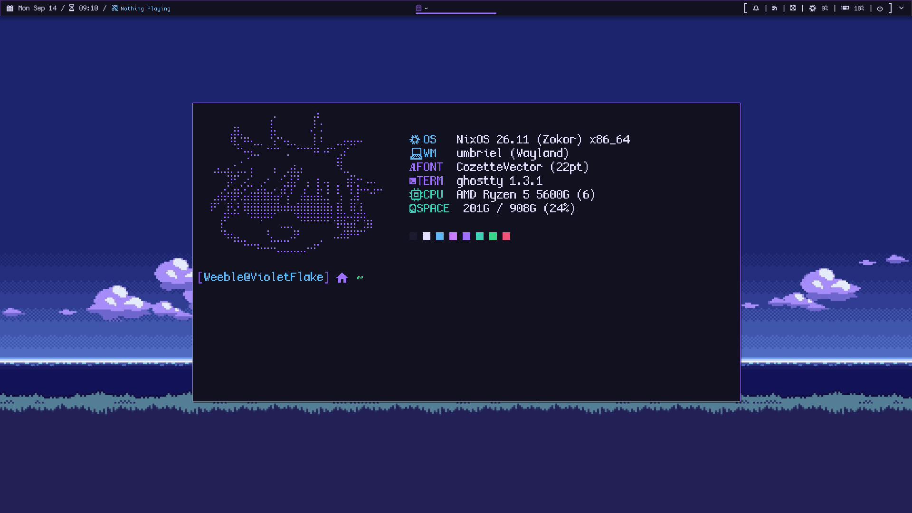
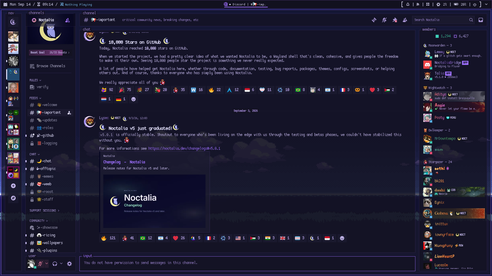
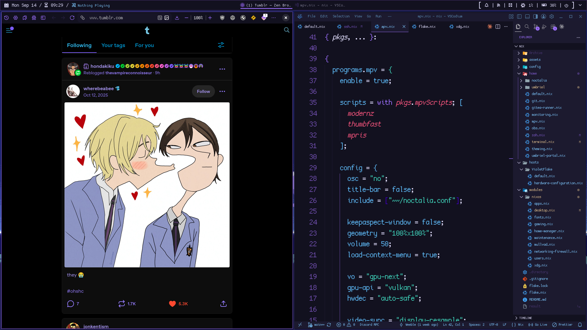

# My Nix Config

My desktop configuration focused on making things personal and purple.

### To Do

- [ ] Make gaming real
- [x] Choose between Dolphin or Pcmanfm
- [x] Find GRUB theme
- [ ] Change noctalia sounds
- [x] Find cool pixel art wallpaper
- [ ] Add Recyclarr
- [ ] Wine fonts???
- [ ] Set more floating window rules
- [x] New Fastfetch Theme
- [x] Add imperative dotfiles

## Programs

| Component       | Program         |
| --------------- | --------------- |
| Windows Manager | Umbriel         |
| Terminal        | Ghostty         |
| Shell           | zsh             |
| Fetch           | Fastfetch       |
| File Manager    | Dolphin         |
| Editor          | Neovim/VScodium |
| Browser         | zen-browser     |

Launcher, login, lock screen, bar, and color theme are handled by Noctalia v5

I also got programs like btop and cava for extra pretty points uwu

## Keybinds

Umbriel

`Mod` is the Super / Windows key.

### Basics

| Keybind               | Action                     |
| --------------------- | -------------------------- |
| `Mod` + `Q`           | Close window               |
| `Mod` + `M`           | Toggle maximize            |
| `Mod` + `G`           | Toggle maximize to edges   |
| `Mod` + `Shift` + `F` | Toggle fullscreen          |
| `Print`               | Screenshot a region        |
| `Mod` + `Print`       | Screenshot the full screen |

### Navigation

| Keybind                      | Action                                 |
| ---------------------------- | -------------------------------------- |
| `Mod` + `Up` / `Page Up`     | Previous workspace                     |
| `Mod` + `Down` / `Page Down` | Next workspace                         |
| `Mod` + `Left`               | Focus window to the left               |
| `Mod` + `Right`              | Focus window to the right              |
| `Mod` + `Scroll Up`          | Focus window to the left               |
| `Mod` + `Scroll Down`        | Focus window to the right              |
| `Mod` + `Shift` + `Up`       | Move window to the output on the right |
| `Mod` + `Shift` + `Down`     | Move window to the output on the left  |
| `Mod` + `Alt` + `Up`         | Move column left                       |
| `Mod` + `Alt` + `Down`       | Move column right                      |
| `Mod` + `I`                  | Toggle overview                        |

### Applications

| Keybind          | Action                        |
| ---------------- | ----------------------------- |
| `Mod` + `Return` | Launch Ghostty (terminal)     |
| `Mod` + `F`      | Launch Dolphin (file manager) |
| `Mod` + `R`      | Launch NewsFlash (RSS reader) |
| `Mod` + `A`      | Toggle calculator panel       |

### Noctalia

| Keybind                   | Action                 |
| ------------------------- | ---------------------- |
| `Mod`                     | Toggle launcher        |
| `Mod` + `C`               | Toggle control center  |
| `Mod` + `S`               | Toggle settings        |
| `Mod` + `Menu`            | Toggle wallpaper panel |
| `Mod` + `Shift` + `R`     | Reload config          |
| `Ctrl` + `Alt` + `Delete` | Toggle session panel   |

### Audio

| Keybind       | Action       |
| ------------- | ------------ |
| `Volume Up`   | Raise volume |
| `Volume Down` | Lower volume |
| `Mute`        | Toggle mute  |

### Media

| Keybind | Action         |
| ------- | -------------- |
| `F5`    | Stop           |
| `F6`    | Previous track |
| `F7`    | Play / pause   |
| `F8`    | Next track     |

### Plugins

| Keybind                  | Action                   |
| ------------------------ | ------------------------ |
| `Mod` + `T`              | Toggle Pomodoro panel    |
| `Mod` + `N`              | Toggle Notes panel       |
| `Mod` + `L`              | Toggle To-do panel       |
| `Mod` + `Shift` + `Menu` | Toggle Wallhaven browser |

### Scratchpad

| Keybind                   | Action                         |
| ------------------------- | ------------------------------ |
| `Mod` + `Space`           | Toggle scratchpad              |
| `Mod` + `Shift` + `Space` | Move window to scratchpad      |
| `Mod` + `Ctrl` + `Space`  | Restore window from scratchpad |
| `Mod` + `Tab`             | Focus next scratchpad window   |

### Clipboard

| Keybind               | Action                   |
| --------------------- | ------------------------ |
| `Mod` + `Shift` + `V` | Toggle clipboard history |

## Icons and Previews

Font: [CozetteVector](https://github.com/the-moonwitch/Cozette)

Icons: [Pixora](https://github.com/tsora1603/pixora-icons), [Pixelitos](https://github.com/ItsZariep/pixelitos-icon-theme), [Simple Pixel icon pack](https://github.com/PaulLesur/plasma-pixel-icon-theme), [Papirus](https://github.com/PapirusDevelopmentTeam/papirus-icon-theme).

GRUB theme: [Hyperfluent](https://github.com/Coopydood/HyperFluent-GRUB-Theme)

Previews

## Notes

This is mostly a mix of copying, following docs, and AI checks. Not meant to be used by others.
